# ✦ Reiki & Sage — Business Readiness Manual Roadmap (7.8 → 9.3+)

> **Owner Role**: Principal Business Operator + Marketplace PM  
> **Executive Stakeholders**: Jason (Technical & Financial Ops) & Carissa Bright (Master Healer, Quality & Practitioner Gating)  
> **Primary Mandate**: Prove revenue, supply, compliance, and operations — with zero code bloat and limited founder firefighting.  
> **Status**: Ready for Immediate Manual Execution

---

## ✦ Table of Contents
1. [Executive Summary & Readiness Scorecard (7.8 → 9.3+)](#1-executive-summary--readiness-scorecard)
2. [Phase 0 — The One-Page Business Definition (Boutique Sanctuary)](#2-phase-0--the-one-page-business-definition)
3. [Phase 1 — Manual Money-Path Proof (P0: 10–20 Real Paid Loops)](#3-phase-1--manual-money-path-proof-p0)
4. [Phase 2 — Legal Readiness & Attorney Sign-Off (P0)](#4-phase-2--legal-readiness--attorney-sign-off-p0)
5. [Phase 3 — Supply Activation (The First 3–5 Healers)](#5-phase-3--supply-activation-the-first-35-healers)
6. [Phase 4 — Controlled Demand Soft Launch (Warm Channels)](#6-phase-4--controlled-demand-soft-launch-warm-channels)
7. [Phase 5 — Weekly Operating Metrics & Founder Rituals](#7-phase-5--weekly-operating-metrics--founder-rituals)
8. [Phase 6 — Operations & Support Playbook v1](#8-phase-6--operations--support-playbook-v1)
9. [Phase 7 — Trust Packaging & Social Proof](#9-phase-7--trust-packaging--social-proof)
10. [Weekly Execution Checklist for Jason & Carissa](#10-weekly-execution-checklist-for-jason--carissa)

---

## 1. Executive Summary & Readiness Scorecard

| Area | Score (Start) | Score (Target) | What Proves Success | Primary Owner |
| :--- | :---: | :---: | :--- | :--- |
| **1. Cashflow & Money Loop** | 7.6 | **9.5** | 10–20 real sessions paid; Stripe Connect split verified (15–20% platform, 100% tip to healer); 5 consecutive zero-defect runs. | Jason |
| **2. Legal & Contractor Gating** | 7.8 | **9.4** | 4-part legal packet finalized with local healthcare/labor attorney; electronic sign-off + Form W-9 before any healer takes a booking. | Jason & Carissa |
| **3. Supply Marketplace** | 7.5 | **9.2** | 3–5 hand-vetted practitioners live with complete profiles, verified Stripe Express payouts, and active calendar slots. | Carissa |
| **4. Demand & Conversion** | 7.9 | **9.1** | Free 5-min alignment driving 3–5% warm conversion to paid 1:1 sessions without broad ad spend. | Carissa |
| **5. Operating Cadence** | 8.0 | **9.3** | Weekly 45-min founder review ritual running; support playbooks handle disputes in <2 hours without code panic. | Jason & Carissa |
| **6. Compliance & Safe Harbor** | 8.2 | **9.5** | Strict non-medical safe harbor (FTC/FDA/HIPAA non-PHI); zero clinical claims across all public copy. | Carissa |
| **OVERALL READINESS** | **7.8 / 10** | **9.3+ / 10** | **Repeatable, peaceful, legally resilient boutique sanctuary business.** | **Co-Founders** |

---

## 2. Phase 0 — The One-Page Business Definition

### ✦ What Reiki & Sage Is (and Is NOT)
* **What We Are**: A high-trust, boutique hybrid spiritual wellness sanctuary providing daily guided heart alignment, on-demand energetic frequency protocols, and verified 1:1 sacred video / on-site appointments with curated independent practitioners.
* **What We Are NOT**:
  - We are NOT Calm or Headspace (we do not chase 10,000 generic meditation tracks).
  - We are NOT Insight Timer (we are not an open, unvetted directory where anyone can upload audio).
  - We are NOT a medical telehealth clinic (we do not diagnose, prescribe, bill insurance, or store PHI).

### ✦ The Three Core Revenue Pillars
1. **Live 1:1 Sessions (Core Commercial Engine)**:
   - Live Video Resonance Alignment ($88 / 45 min)
   - On-Site In-Person Session ($150 / 60 min, $22.50 upfront 15% deposit)
   - *Split*: Platform takes **15% to 20% commission** on session fee; Healer keeps **80% to 85%**.
2. **Seeker Tips (100% Practitioner Flow)**:
   - Tips given after live video sessions route **100% directly to the healer** (`application_fee_amount: 0`). Platform rakes $0.00.
3. **Sacred Sanctuary Membership**:
   - $29/mo or $290/yr for unlimited access to all 7 Frequency Protocols, Binaural Sound Baths, Voice Reflection Studio, and priority healer booking.

---

## 3. Phase 1 — Manual Money-Path Proof (P0)

> **Mandate**: Do not assume the money loop works because code compiles. Execute **10–20 real paid end-to-end sessions** in production and log every transaction until you achieve **5 consecutive flawless runs**.

### Step 1.1: Verify Stripe Production Keys & Webhooks
1. Log into [Stripe Dashboard](https://dashboard.stripe.com).
2. Confirm you are in **Live Mode** (toggle on top-left).
3. Verify your webhook endpoint:
   - URL: `https://reikiandsage.com/api/stripe-webhook` (or your active Vercel domain).
   - Events monitored:
     - `checkout.session.completed`
     - `payment_intent.succeeded`
     - `account.updated` (for Stripe Connect onboarding)
     - `charge.refunded`
4. Confirm environment variables in Vercel Dashboard (`Settings → Environment Variables`):
   - `STRIPE_SECRET_KEY` = `sk_live_...`
   - `STRIPE_WEBHOOK_SECRET` = `whsec_...`
   - `VITE_STRIPE_PUBLISHABLE_KEY` = `pk_live_...`

### Step 1.2: Execute the 10-Session Paid Verification Matrix
Run the following matrix with real cards (use $1.00 test products or small real deposits, then process standard refunds if testing internally):

| Test # | Platform | Device / Browser | Service Type | Amount | Tip Tested? | Payout Verified? | Clean? |
| :---: | :--- | :--- | :--- | :--- | :---: | :---: | :---: |
| **01** | Mobile Web | iPhone / Safari | Live Video ($88) | $88.00 | $10 (100% Healer) | Yes (Stripe Connect) | [ ] Pass |
| **02** | Desktop | Chrome / Mac | On-Site Deposit ($150) | $22.50 | N/A | Yes (Platform account) | [ ] Pass |
| **03** | Mobile Web | Android / Chrome | Live Video ($88) | $88.00 | $5 (100% Healer) | Yes (Stripe Connect) | [ ] Pass |
| **04** | Desktop | Edge / Windows | Live Video ($88) | $88.00 | $0 (No tip test) | Yes (85% Healer / 15% Plat) | [ ] Pass |
| **05** | Mobile PWA | Add-to-Homescreen | Live Video ($88) | $88.00 | $15 (100% Healer) | Yes (Stripe Connect) | [ ] Pass |
| **06** | Desktop | Safari / Mac | Membership Sub ($29) | $29.00 | N/A | Yes (Stripe Billing) | [ ] Pass |
| **07** | Desktop | Firefox / Windows | Live Video ($88) | $88.00 | $20 (100% Healer) | Yes (Stripe Connect) | [ ] Pass |
| **08** | Mobile Web | iPad / Safari | On-Site Deposit ($150) | $22.50 | N/A | Yes (Platform account) | [ ] Pass |
| **09** | Desktop | Chrome / Windows | Live Video ($88) | $88.00 | $10 (100% Healer) | Yes (Stripe Connect) | [ ] Pass |
| **10** | Mobile Web | iPhone / Chrome | Live Video ($88) | $88.00 | $25 (100% Healer) | Yes (Stripe Connect) | [ ] Pass |

### Step 1.3: Verification Checklist for Each Transaction
In the Stripe Dashboard, inspect the resulting **PaymentIntent**:
* [ ] **Gross Amount**: Matches the advertised session fee.
* [ ] **Application Fee (`application_fee_amount`)**: Exactly 15% (e.g., $13.20 on an $88 session).
* [ ] **Transfer Destination (`transfer_data[destination]`)**: Points to the healer's connected Stripe account (`acct_...`).
* [ ] **Tip PaymentIntent**: If a tip was provided, inspect the second transaction. Confirm `application_fee_amount == 0` and destination is the healer.
* [ ] **Seeker Receipt**: Customer received an itemized Stripe email receipt specifying the appointment time and non-medical wellness description.
* [ ] **Sanctuary Dashboard**: Booking immediately appears under Seeker Dashboard and Healer Schedule as `Confirmed`.

---

## 4. Phase 2 — Legal Readiness & Attorney Sign-Off (P0)

> **Mandate**: In spiritual and energy healing, legal resilience comes from clear contractor boundaries, explicit non-medical waivers, and strict non-PHI data handling.

### Step 2.1: The 4-Part Contractor Legal Packet (Already in Codebase)
The codebase includes complete drafts in [`src/features/healer-marketplace/domain/HealerAgreementService.js`](file:///c:/Users/Jason/OneDrive/Desktop/chrissas-project/src/features/healer-marketplace/domain/HealerAgreementService.js). Take these 4 documents to your local attorney (recommended: Washington state licensed healthcare/labor attorney):

1. **Document 1: Master Independent Practitioner Agreement (IPA v2026.2)**
   - *Key Clauses*:
     - Practitioner is an independent contractor (IRS 1099), not an employee or agent.
     - Platform takes 15%–20% technology fee on completed session fees.
     - 100% of seeker tips go directly to the practitioner.
     - Practitioner sets their own schedule, provides their own healing tools, and controls their own energetic methods.
     - Mutual 30-day no-cause termination; immediate termination for ethical breaches or seeker endangerment.
2. **Document 2: Independent Practitioner Handbook (19 Sacred Sections)**
   - *Key Clauses*:
     - Zero medical diagnosis, zero drug prescribing, zero guarantees of physical cure.
     - Strict non-sexual touch guidelines (therapeutic, fully clothed, consent-driven).
     - 24-hour mandatory response standard for booking requests.
     - Minimum 15-minute energetic integration buffer between sessions.
3. **Document 3: Form W-9 & 1099-NEC Tax & Payout Responsibility Acknowledgment**
   - *Key Clauses*:
     - Healer confirms sole responsibility for federal, state, and local self-employment taxes.
     - Consent to electronic Form 1099 delivery via Stripe Express.
4. **Document 4: Sanctuary Privacy, Non-Medical & Client Care Addendum**
   - *Key Clauses*:
     - Platform does not collect, store, or transmit Protected Health Information (PHI) under HIPAA.
     - Sessions are spiritual/energetic wellness practices protected under Washington State complementary wellness safe harbors.

### Step 2.2: Instructions for Attorney Review
Send the following email to your legal counsel:
```text
Subject: Legal Review Request: Independent Contractor & Wellness Waiver Packet for Reiki & Sage

Dear [Attorney Name],

We have prepared the commercial and contractor packet for Reiki & Sage, a boutique marketplace connecting seekers with independent Reiki practitioners for virtual and local energy healing sessions.

Attached are our 4 core documents:
1. Independent Practitioner Master Agreement (1099 contractor terms & platform commission)
2. Practitioner Standards Handbook (19 conduct, touch, and non-medical boundaries)
3. Form W-9 / 1099-NEC Tax Acknowledgment
4. Seeker Non-Medical Safe Harbor Waiver & Privacy Addendum

Could you please review and confirm:
1. Classification resilience under Washington state & federal independent contractor tests.
2. Robustness of our FTC/FDA non-medical disclaimer and HIPAA non-PHI posture.
3. Enforceability of the 100% tip pass-through and 15% platform technology commission.

Thank you,
Jason & Carissa Bright
Founders, Reiki & Sage
```

---

## 5. Phase 3 — Supply Activation (The First 3–5 Healers)

> **Mandate**: A marketplace lives or dies on practitioner trust. Do not recruit 50 random healers. Onboard **3 to 5 hand-selected, master-level practitioners** who embody the sanctuary's frequency.

### Step 3.1: The 9-Stage Onboarding Gate
Every practitioner must pass all 9 steps before the system unlocks their booking calendar:

```mermaid
flowchart LR
    A["1. Application Submitted"] --> B["2. Carissa 30-Min Sacred Interview"]
    B --> C["3. Carissa Approval in Admin Console"]
    C --> D["4. Healer Claims Account & Signs 4 Legal Docs"]
    D --> E["5. Connects Bank via Stripe Express"]
    E --> F["6. Sets Weekly Availability & Travel Radius"]
    F --> G["7. Completes Bio, Photo, Lineage & Modality"]
    G --> H["8. Final Smoke Test Session with Jason"]
    H --> I["9. ACTIVE IN SANCTUARY"]
```



### Step 3.2: Carissa's 30-Minute Healer Interview Script
Carissa conducts this over live video. Score each candidate on a 1–5 scale:
1. **Lineage & Attunement Check**: *"Who attuned you to Reiki Master / Practitioner level? What lineage do you practice (Usui, Holy Fire, Karuna)?"*
2. **Grounding & Presence**: *"How do you ground yourself before and after working with a seeker carrying intense trauma or emotional grief?"*
3. **Boundaries & Safe Harbor**: *"If a seeker asks if Reiki can cure their stage-4 cancer or replace their psychiatric medication, what is your exact verbal response?"*  
   *(Must answer: Reiki is complementary spiritual support; seeker must remain under the care of licensed medical physicians).*
4. **Reliability Commitment**: *"Are you able to commit to responding to booking requests within 24 hours and maintaining a 0% unexcused no-show record?"*

### Step 3.3: First Cohort Target Roster
* **Practitioner 1**: Master Healer Carissa Bright (Anchor Healer — Live Video & In-Person Seattle Metro).
* **Practitioner 2**: Senior Sound & Energy Specialist (Live Video & Remote Frequency Balancing).
* **Practitioner 3**: Usui Shiki Ryoho Master (In-Person Seattle Eastside: Bellevue, Kirkland, Redmond).
* **Practitioner 4**: Intuitive Breath & Chakra Alignment Practitioner (Live Video).

---

## 6. Phase 4 — Controlled Demand Soft Launch (Warm Channels)

> **Mandate**: Avoid broad social ad spend. Cold ads destroy unit economics when the conversion funnel is uncalibrated. Drive warm, high-affinity seekers through the free trust engine.

### Step 4.1: The Warm Acquisition Playbook
1. **Carissa's Private Seeker List**:
   - Send personal email invitation to past clients and students.
   - Message: *"We have created a dedicated, peaceful digital Sanctuary. Come experience our 5-Minute Daily Alignment for free, and reserve your sacred session directly."*
2. **Local Seattle Metaphysical & Wellness Centers**:
   - High-end physical cards placed in partnering tea shops, botanical apothecaries, and yoga studios in Capitol Hill, Fremont, and Ballard.
   - QR code linking directly to the Free 5-Minute Grounding Portal.
3. **Targeted Micro-Content**:
   - 30-second clips of Carissa guiding a heart-grounding breath, ending with: *"Begin your free 5-minute alignment today at ReikiAndSage.com."*

### Step 4.2: The 5-Step Soft-Launch Funnel Architecture
```
[1. Seeker Arrival] → [2. Free 5-Min Alignment] → [3. Sacred Completion Affirmation]
                                                               ↓
[5. Repeat / Return] ← [4. Reserve 1:1 Live Video Session ($88)]
```

* **Funnel Conversion Targets**:
  - Landing Page to Free Session Completion: **≥ 45%**
  - Free Session Completion to Profile Creation: **≥ 15%**
  - Profile Creation to Paid 1:1 Booking: **≥ 8%**
  - Paid Session Completion to Healer Tip: **≥ 60%**
  - Paid Session Completion to 5-Star Review: **≥ 70%**

---

## 7. Phase 5 — Weekly Operating Metrics & Founder Rituals

### Step 7.1: The 8 Weekly Core Metrics
Jason and Carissa track these every Monday morning:

| Metric | Target | Formula | Where to Look |
| :--- | :---: | :--- | :--- |
| **1. Free Alignment Completions** | 100+/wk | Total sessions reaching `isCompleted === true` | Firebase / MongoDB `session-logs` |
| **2. Booking Rate** | 5%–10% | `Paid Bookings / Free Completions` | Stripe Dashboard & Firestore `bookings` |
| **3. Paid Completion Rate** | ≥ 95% | `Sessions Completed / Sessions Booked` | Daily.co call logs & Firestore |
| **4. Healer Tip Rate** | ≥ 60% | `Tip Transactions / Completed Sessions` | Stripe Connect Transfer logs |
| **5. Average Tip Amount** | $12–$18 | `Total Tip Dollars / Total Tips Count` | Stripe Dashboard |
| **6. Healer Response Time** | < 4 hrs | Time from request to healer accept | Healer OS database timestamp |
| **7. Refund & No-Show Rate** | < 2% | `Refunded Sessions / Total Sessions` | Stripe Refunds & Support Log |
| **8. Returning Seeker Rate** | ≥ 25% | `Seekers with 2+ bookings / Total Seekers` | MongoDb / Firestore profiles |

### Step 7.2: The Monday 45-Minute Founder Ritual
* **00:00 – 00:15 (Jason)**: Review Stripe net revenue, platform commissions, pending payouts, and serverless error rates.
* **00:15 – 00:30 (Carissa)**: Review healer ratings, new practitioner applications, and seeker testimonials.
* **00:30 – 00:45 (Joint)**: Decide on any healer approvals, approve payout releases, and review support log.

---

## 8. Phase 6 — Operations & Support Playbook v1

### Scenario A: Seeker Experiences Audio/Video Disconnection
* **Policy**: If technical connection fails for >5 minutes of an active session, healer will offer an immediate 15-minute extension or reschedule free of charge.
* **Jason's Tech Action**: Verify Daily.co room status in dashboard. If server issue, issue instant full credit or re-invite.
* **Seeker Message Template**:
  > *"Beloved [Seeker Name], we noticed the digital connection was disrupted during your sacred session today. Your peace of mind is our priority. We have issued a complimentary session credit to your account, or we can reschedule directly with [Healer Name]."*

### Scenario B: Seeker Cancels or Misses Session (No-Show)
* **Policy**:
  - Cancellation > 24 hours prior: **100% full refund**.
  - Cancellation < 24 hours prior: **50% cancellation fee** (transferred to healer for held time).
  - Unexcused Seeker No-Show: **Fee forfeited**; 85% goes to healer.
  - Healer No-Show: **100% immediate refund** to seeker + $20 platform apology credit. Healer receives formal strike. (2 strikes = removal).

### Scenario C: Chargeback or Stripe Dispute
* **Action**: Jason immediately responds within Stripe Dashboard using our standardized template:
  - Submit signed Seeker Non-Medical Consent timestamp.
  - Submit Daily.co WebRTC connection log showing IP and duration.
  - Submit itemized booking confirmation and email receipt.

---

## 9. Phase 7 — Trust Packaging & Social Proof

### Step 9.1: Authentic Testimonial Collection Protocol
* **Trigger**: Immediately following the sacred twilight completion screen in `PostSessionReflection.jsx`, prompt seeker:
  > *"How does your energy feel right now? Leave a gentle reflection for [Healer Name]."*
* **Display Rule**:
  - Only show reviews from verified paid sessions.
  - Anonymize seeker names by default (`Sarah M., Seattle WA` or `Aura Seeker`).
  - Do not publish reviews that mention curing diseases or medical conditions (to maintain FDA/FTC compliance).

### Step 9.2: Transparent Pricing Display
Ensure the booking modal displays exact fees before card entry:
* Live Video Resonance: **$88 USD** (45 Minutes)
* On-Site Healing: **$150 USD** ($22.50 non-refundable 15% deposit online, $127.50 balance at appointment)
* Gratuity: **Optional, 100% direct to practitioner**

---

## 10. Weekly Execution Checklist for Jason & Carissa

### Week 1: Money-Loop Hardening & Legal Review
- [ ] Jason runs tests #1 to #5 of the Paid Verification Matrix with real cards.
- [ ] Jason confirms Stripe Connect transfers and zero platform fee on tips.
- [ ] Carissa emails the 4-part legal packet to local counsel for written sign-off.
- [ ] Jason verifies Vercel production environment variables and webhook signatures.

### Week 2: First Healer Cohort Activation
- [ ] Carissa interviews candidate healers #2 and #3.
- [ ] Approved healers complete the 9-stage onboarding gate and connect their Stripe Express bank accounts.
- [ ] Healers set their live weekly availability calendar in the Sanctuary dashboard.
- [ ] Conduct one end-to-end smoke test appointment with each onboarded healer.

### Week 3: Controlled Soft Launch (Carissa's Warm Audience)
- [ ] Send warm invitation announcement to Carissa's private email list.
- [ ] Distribute physical sanctuary cards to 3 local Seattle partner wellness spaces.
- [ ] Monitor Monday metrics: Free completion rate, booking conversion, and Stripe payouts.
- [ ] Collect first 5 authentic reviews and feature on landing page.

### Week 4: Autonomy Verification (Founders Out of the Loop)
- [ ] First paid booking completed end-to-end where neither Jason nor Carissa was in the video room.
- [ ] Stripe payout disbursed to independent healer without manual founder intervention.
- [ ] Review weekly scorecard: Confirm Business Readiness achieves **9.3+ / 10**.
