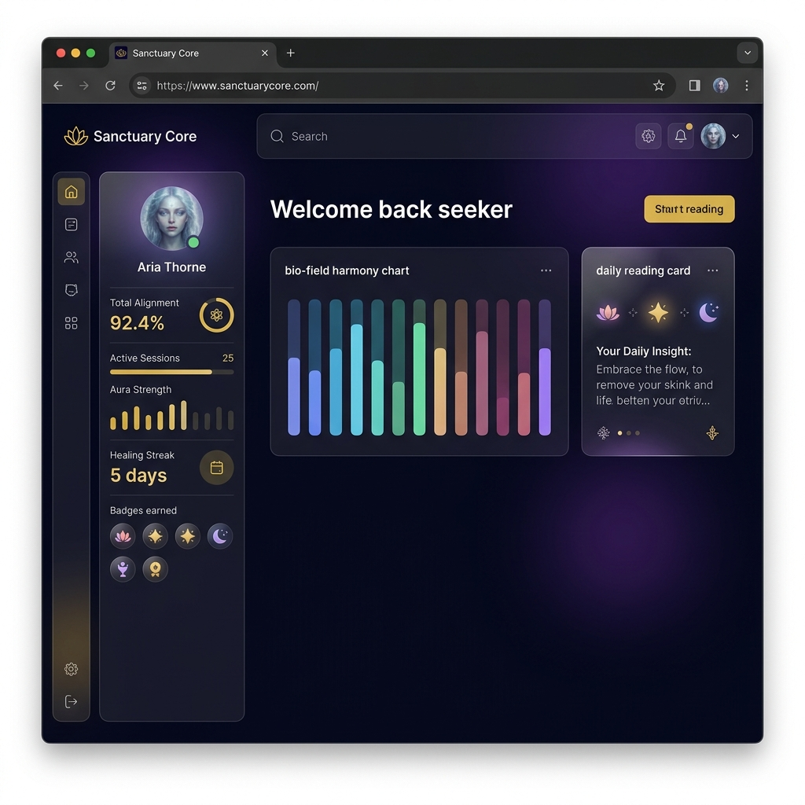
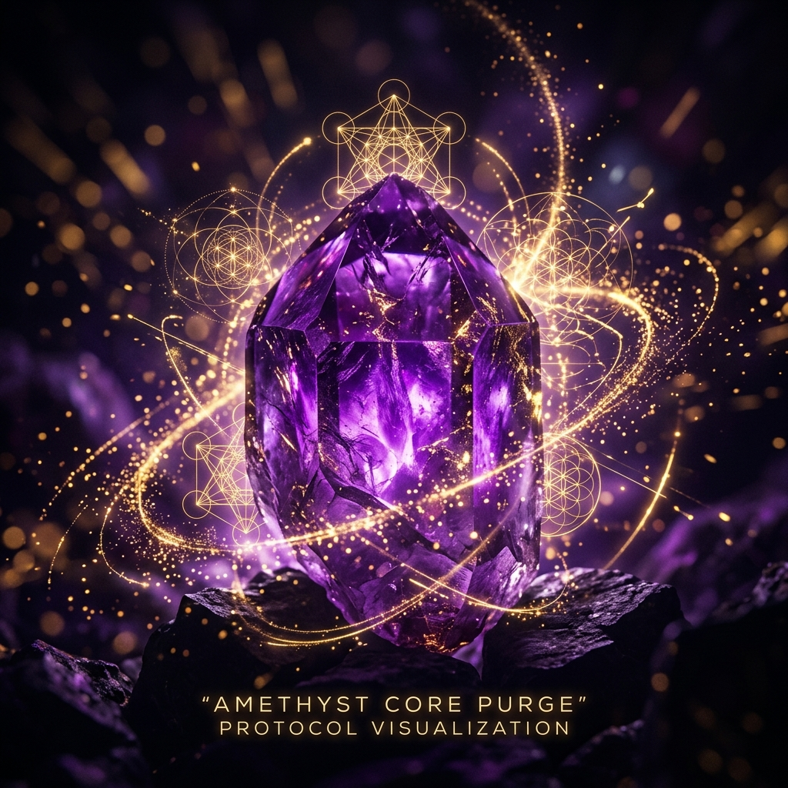

<p align="center">
  
</p>

<h1 align="center">✨ Reiki Healing Sanctuary</h1>

<p align="center">
  <em>Where ancient energy meets modern technology.</em>
</p>

<p align="center">
  <a href="#-live-demo"></a>
  
  
  
  
</p>

---

An immersive digital platform offering **crystal-powered Reiki healing protocols** with stunning visuals, golden energy particles, guided sessions, and a personal Sanctuary dashboard. Built for emotional balance, stress relief, heart healing, and spiritual growth.

> *Your bio-field is showing exceptional resonance today.*

---

## 🌐 Live Demo

🔗 **[reiki-healing-sanctuary.vercel.app](https://reiki-healing-sanctuary.vercel.app)**

---

## 🌿 Vision

**Reiki Healing Sanctuary** was born from a simple belief: *healing energy should be accessible to everyone, everywhere.*

Created by a Seattle-based Reiki practitioner and developer, this platform brings the warmth of hands-on healing into an immersive digital experience — blending sacred crystal frequencies with modern web technology.

Whether you're beginning your healing journey or deepening an existing practice, the Sanctuary meets you where you are.

---

## 📸 App Preview

### Sanctuary Dashboard
> Your personal healing hub — track sessions, streaks, aura strength, and vibrational progress.

<p align="center">
  
</p>

### 7-Step Mystical Onboarding
> A guided sign-up flow that calibrates your energy profile and healing intentions.

<p align="center">
  
</p>

---

## 🔮 Crystal Healing Protocols

<table>
  <tr>
    <td align="center" width="25%">
      <br/>
      <strong>Amethyst Core Purge</strong><br/>
      <em>Deep cleanse & spiritual clarity</em>
    </td>
    <td align="center" width="25%">
      <br/>
      <strong>Rose Quartz Heart-Sync</strong><br/>
      <em>Heart healing & compassion</em>
    </td>
    <td align="center" width="25%">
      <br/>
      <strong>Quartz Lattice Uplift</strong><br/>
      <em>Energy amplification & clarity</em>
    </td>
    <td align="center" width="25%">
      <br/>
      <strong>Sage Purification</strong><br/>
      <em>Aura cleansing & grounding</em>
    </td>
  </tr>
</table>

---

## ⚡ Key Features

| Feature | Description |
|---|---|
| 🌀 **7-Step Mystical Onboarding** | Guided sign-up that calibrates your energy profile and healing intentions |
| 🏛️ **Sanctuary Dashboard** | Personal healing hub — stats, streaks, badges, vibrational charts |
| 🔥 **Healing Streaks & Badges** | Daily streak tracking with milestone achievements (First Light → Master) |
| 🤖 **Aura Guide** | AI-assisted consultation for personalized protocol recommendations |
| 💎 **Crystal Protocols** | Amethyst Core Purge · Rose Quartz Heart-Sync · Quartz Lattice Uplift · Sage Purification |
| 🔴 **Live Resonance Portal** | Real-time group healing sessions with guided frequency immersion |
| 🆓 **Free Seeker Tier** | Explore foundational protocols at no cost — upgrade when you're ready |
| 🔒 **Secure Stripe Checkout** | PCI-compliant payments — we never see your card details |
| ⭐ **Collective Reverie** | Share and read community healing stories and testimonials |
| 📊 **Vibrational Log** | Track your healing history with bio-field harmony charts |

---

## ⚙️ Tech Stack

| Layer | Technology |
|---|---|
| **Frontend** | React 19 · Vite 7 · Framer Motion · Recharts |
| **Auth & Database** | Firebase Auth · Cloud Firestore |
| **Payments** | Stripe Checkout (PCI-compliant) |
| **Backend** | Vercel Serverless Functions |
| **Hosting** | Vercel Edge Network |
| **Styling** | Vanilla CSS · Glassmorphism · Custom Particle Animations |
| **Security** | CSP Headers · Firestore Row-Level Security · HTTPS Enforced |

---

## 🛠️ Run Locally

### Prerequisites
- Node.js 18+
- npm 9+
- Firebase project ([create one](https://console.firebase.google.com))
- Stripe account ([sign up](https://stripe.com))

### Setup

```bash
# Clone the repository
git clone https://github.com/your-username/reiki-healing-sanctuary.git
cd reiki-healing-sanctuary

# Install dependencies
npm install

# Configure environment variables
cp .env.example .env.local
# Edit .env.local with your Firebase + Stripe keys (see .env.example for details)

# Start the dev server
npm run dev
```

The app runs at **http://localhost:4000**

### Build for Production

```bash
npm run build    # Output in dist/
npm run preview  # Preview production build locally
```

---

## 📁 Project Structure

```
├── api/                    # Vercel serverless functions
│   ├── create-checkout.js  # Stripe Checkout session creation
│   └── stripe-webhook.js   # Stripe payment event handler
├── public/assets/          # Static images & protocol visuals
├── src/
│   ├── components/         # React components
│   │   ├── Login.jsx       # Firebase Auth login
│   │   ├── SignupFlow.jsx   # 7-step onboarding
│   │   ├── UserDashboard.jsx    # Sanctuary Dashboard
│   │   ├── HealerDashboard.jsx  # Admin panel
│   │   ├── BillingForm.jsx      # Stripe Checkout redirect
│   │   └── ...
│   ├── lib/firebase.js     # Firebase client (Auth + Firestore)
│   ├── utils/              # Horoscopes, helpers
│   └── App.jsx             # Main application
├── firestore.rules         # Firestore security rules
├── vercel.json             # Security headers + routing
└── .env.example            # Environment variable template
```

---

## 🗺️ Roadmap

- [ ] 🎵 Guided meditation audio tracks with binaural frequencies
- [ ] 📱 Mobile app (React Native)
- [ ] 📅 Healer booking & calendar integration
- [ ] 🌍 Multi-language support (Spanish, Japanese, Portuguese)
- [ ] ⌚ Wearable integration for heart-rate resonance feedback
- [ ] 🎙️ Voice-recorded healing reflections

---

## ⚠️ Disclaimer

Reiki Healing Sanctuary is a **spiritual wellness platform** designed for relaxation, mindfulness, and personal growth. It is **not** a substitute for professional medical advice, diagnosis, or treatment. We do not provide medical advice or store personal health data. Always consult a qualified healthcare provider for medical concerns.

---

## 👤 About the Creator

Built with intention by a Reiki practitioner and developer based in **Seattle, WA** — blending a passion for energy healing with modern web technology to make the Sanctuary experience available to seekers everywhere.

<p align="center">
  <a href="https://x.com/Jasontapout360">
    
  </a>
</p>

---

<p align="center">
  <em>「 Healing begins when you say yes. 」</em><br/><br/>
  <sub>© 2026 Reiki Healing Sanctuary — All rights reserved.</sub>
</p>
